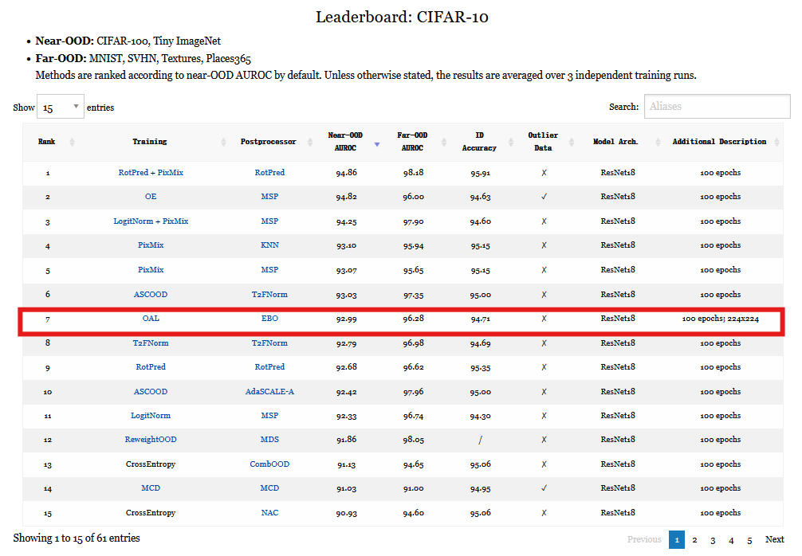

# OAL

> Heng Gao, Zhuolin He, Jian Pu*    
> Fudan University  

Coming soon.

## Benchmark Evaluation



```
@misc{gao2024oalenhancingooddetection,
      title={OAL: Enhancing OOD Detection Using Latent Diffusion}, 
      author={Heng Gao and Zhuolin He and Shoumeng Qiu and Jian Pu},
      year={2024},
      eprint={2406.16525},
      archivePrefix={arXiv},
      primaryClass={stat.ML},
      url={https://arxiv.org/abs/2406.16525}, 
}
```
